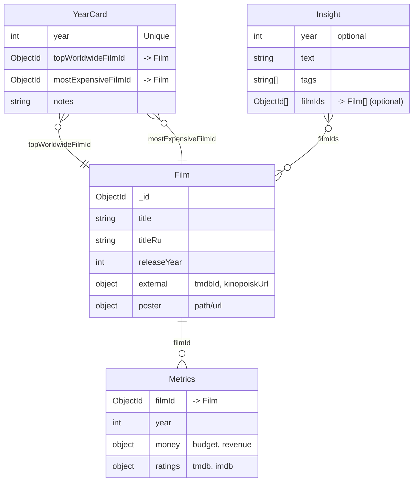

# BoxOffice65

Сервис, который по каждому году сравнивает:

* **самый кассовый фильм** (по `revenue`)
* **самый дорогой фильм** (по `budget`)

Дополнительно: каталог фильмов, импорт по TMDb ID, факты/инсайты и авто-пересчёт победителей при изменении метрик.

---

## Возможности

*  Вкладка **«Годы»**: карточка года с победителями (касса vs бюджет)
*  Вкладка **«Фильмы»**: список всех фильмов с поиском и сортировкой (RU/EN)
*  Вкладка **«Добавить»**: импорт фильма по **TMDb ID** (метаданные, постер, бюджет/сборы, рейтинги)
*  Автоматический пересчёт победителей года при создании/обновлении метрик (**Mongoose middleware**)
*  Факты/инсайты: короткие заметки, связанные с годом и/или фильмами
*  Ссылки на **TMDb** и **КиноПоиск** (если известны)

---

## Стек

* **Database**: MongoDB
* **Backend**: Node.js, Express, Mongoose, TypeScript
* **Frontend**: React, Vite, TypeScript

---

## Быстрый старт

### Требования

* Node.js (LTS)
* MongoDB (локально) или MongoDB Atlas
* TMDb API key (Уже присутствует, но можно заменить на свой)

### Конфигурация

Создайте файл `server/.env` (пример — `server/.env.example`, если он есть):

MONGODB_URI=mongodb://127.0.0.1:27017/boxoffice65
TMDB_API_KEY=YOUR_TMDB_API_KEY
PORT=3001

> Важно: `.env` должен лежать именно в `server/`, чтобы сервер гарантированно видел `TMDB_API_KEY`.

### Установка и запуск

В корне репозитория:

npm install

(опционально) очистка базы и заполнение стартовыми данными:
npm run reset

dev-режим (сервер + клиент):
npm run dev

Открыть UI: `http://localhost:5173`
API по умолчанию: `http://localhost:3001`

---

## Как пользоваться

### Вкладка «Годы»

* Слева список лет → выбираете год → справа карточка:

  * **Самый кассовый**
  * **Самый дорогой**
  * бюджет/сборы/рейтинг (если доступны)
  * ссылки на TMDb/КиноПоиск

### Вкладка «Фильмы»

* Поиск по RU/EN названию
* Фильтр по году
* Сортировка (год/бюджет/сборы/рейтинг)
* Быстрые ссылки на TMDb и КиноПоиск

### Вкладка «Добавить»

* Вставляете **TMDb ID** (из ссылки вида `https://www.themoviedb.org/movie/<ID>`)
* Нажимаете **«Импортировать»**
* Система создаёт/обновляет `Film` и `Metrics`, подтягивает постер и пересчитывает победителей года автоматически

---

## Импорт/экспорт базы данных (зачем и как)

### Зачем это нужно

* **Импорт**: чтобы проект на любом компьютере стартовал уже с готовой базой (без ручного наполнения)
* **Экспорт**: чтобы зафиксировать актуальное состояние (после импорта фильмов через UI/скрипты)

### Экспорт (сделать дамп базы)

mongodump --uri="mongodb://127.0.0.1:27017/boxoffice65" --out=./db_dump

### Импорт (восстановить базу из дампа)

mongorestore --drop --uri="mongodb://127.0.0.1:27017/boxoffice65" ./db_dump/boxoffice65

> Папку `db_dump` можно приложить к сдаче как “стартовую базу” (по требованиям преподавателя).

---

## Режимы запуска: dev и production

### Dev (разработка)

`npm run dev`

* hot reload (клиент)
* удобные логи
* быстрые итерации

### Production (сборка и запуск)

Команды зависят от `package.json`, но типовой сценарий:

npm run build
npm run start

* запускается собранный фронтенд
* сервер работает как “финальная” версия без dev-режима

---

## Структура репозитория

```
.
├─ server/          # Express + Mongoose (API, модели, сервисы)
├─ tools/           # Инструменты для создания первоначальной базы данных
├─ web/             # React + Vite (UI)
├─ package.json     # корневые скрипты
└─ README.md
```

---

## Модель данных (ERD)



---

## Индексы (целостность и скорость)

* `YearCard.year` — **unique**
* `Metrics: { filmId, year }` — **unique**
* `Film.external.tmdbId` — **unique + sparse**
* Поиск:

  * `Film` text index по `title` и `titleRu`
  * индекс по `releaseYear` для фильтра/сортировки

---

## “Триггеры” (Mongoose middleware)

Используется middleware как аналог триггеров уровня приложения: при создании/обновлении `Metrics` выполняется пересчёт победителей для года.

* **События:** `save`, `findOneAndUpdate` в коллекции `Metrics`
* **Действие:** вызов `recalcYear(year)`
* **Результат:** обновление `YearCard.topWorldwideFilmId` и `YearCard.mostExpensiveFilmId`

Важно:

* Это не триггеры MongoDB. Механизм работает, когда изменения проходят через Mongoose.
* Для `findOneAndUpdate` год можно получать из `doc` и/или из update/query как fallback.

---

## API (основные маршруты)

Названия могут отличаться — ориентируйтесь на вашу реализацию:

* `GET /api/years` — список лет
* `GET /api/years/:year/details` — карточка года + победители + метрики + факты
* `GET /api/films` — список/поиск/сортировка фильмов
* `POST /api/admin/import/tmdb/:tmdbId` — импорт фильма по TMDb ID
* `POST /api/admin/recalc/:year` — пересчёт года (если есть)
* `POST /api/admin/recalc-all` — пересчёт всех лет (если есть)

---

## Troubleshooting

### `TMDB_API_KEY = MISSING`

Сервер не видит переменную окружения:

* проверьте, что `server/.env` существует и содержит `TMDB_API_KEY=...`
* перезапустите терминал и сервер

Проверка:

node -e "console.log('TMDB_API_KEY=', process.env.TMDB_API_KEY ? 'OK' : 'MISSING')"

### `ECONNREFUSED 127.0.0.1:27017`

MongoDB не запущена или используется другой порт — запустите MongoDB или исправьте `MONGODB_URI`.

### `Year not found (404)`

В базе нет записи для года — выполните `npm run reset` или восстановите базу через `mongorestore`.

### Импорт по TMDb ID не добавляет фильм

Возможные причины:

* неверный ID
* у будущего релиза могут быть пустые `budget/revenue`
* временная ошибка TMDb / лимиты

---

## Источники данных и дисклеймер

Метаданные и изображения загружаются из **The Movie Database (TMDb)**.

> This product uses the TMDB API but is not endorsed or certified by TMDB.

